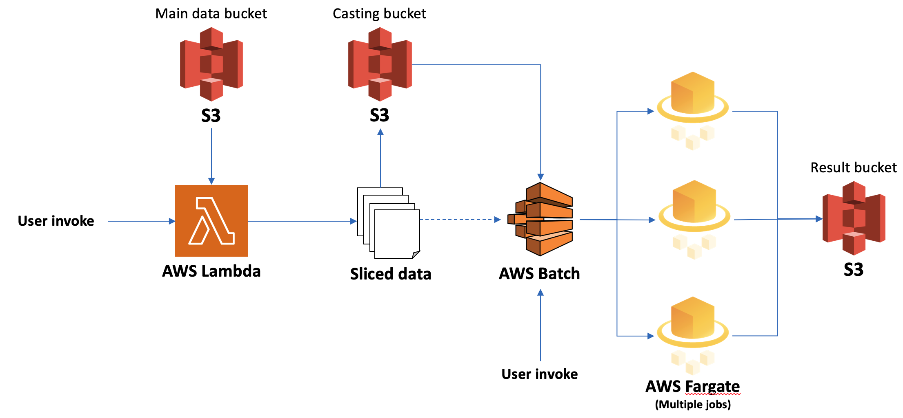
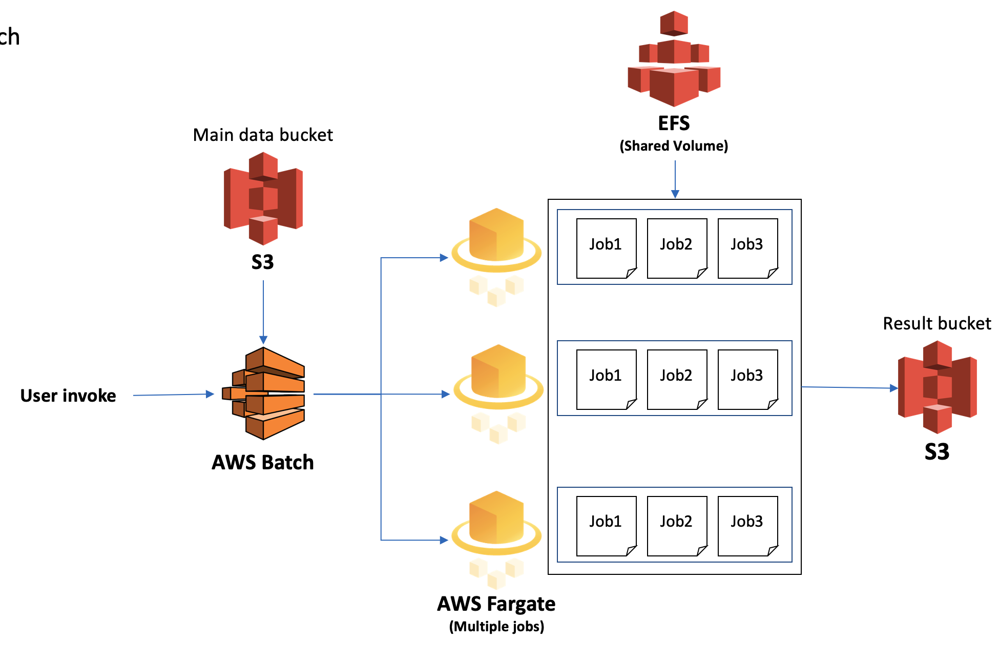

## AWS module for running the project
* This module supports to run the project codes, pipelines and analysis by launching AWS Batch. Currently, it is on development phase and it has limited numbers of data pipelins
* Parallel jobs execution is needed lambda function input, please use lambda_deployment section first

### Batch code structure
```
|-Batch1(activation_score_batch, deg_pipeline_batch)
|   |-batch_module_singleJob.sh(singleJob or parellel)
|   |-configure.json(container_configure and submit_configure)

```

### Requirements on local PC
```
apt-get install awscli
apt-get install jq
```

## Batch Jobs List

[](https://github.com/OpenKBC/activation-score-batch-image/actions/workflows/docker-image.yml)
[](https://github.com/OpenKBC/deg-pipeline-batch-image/actions/workflows/docker-image.yml)
[](https://github.com/OpenKBC/feature-extraction-batch-image/actions/workflows/docker-image.yml)

| Name | Description | Main exec file |
|---------|---------|---------|
| activation_score_batch | Activation score calculation (Parallelized or Single job)| batch_module_singleJob.sh or batch_module_parallel.sh |
| deg_pipeline_batch | DEG calculation pipeline (Array job, sequential) | batch_module_singleJob.sh |
| feature_extraction_batch | Feature extraction pipeline with activation scores | Developing |


### Multiple Jobs Flow


### Array Jobs Flow (Pipeline)

